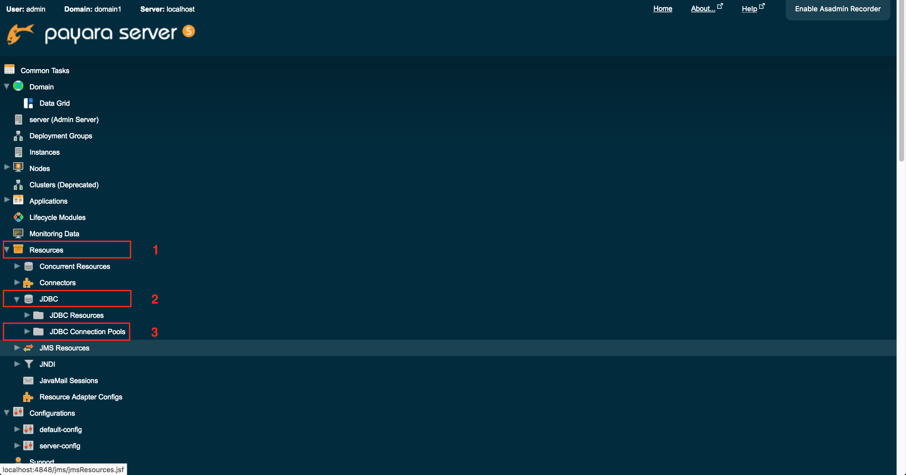
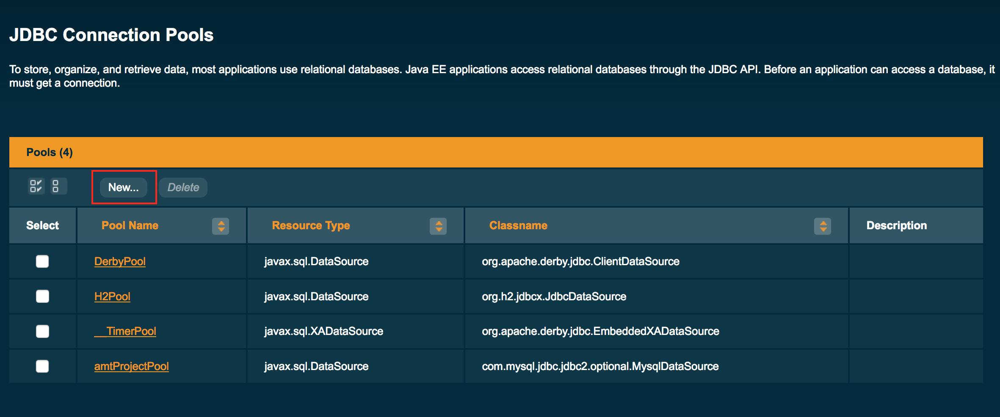
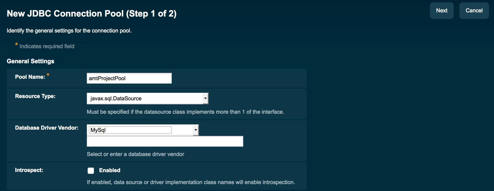
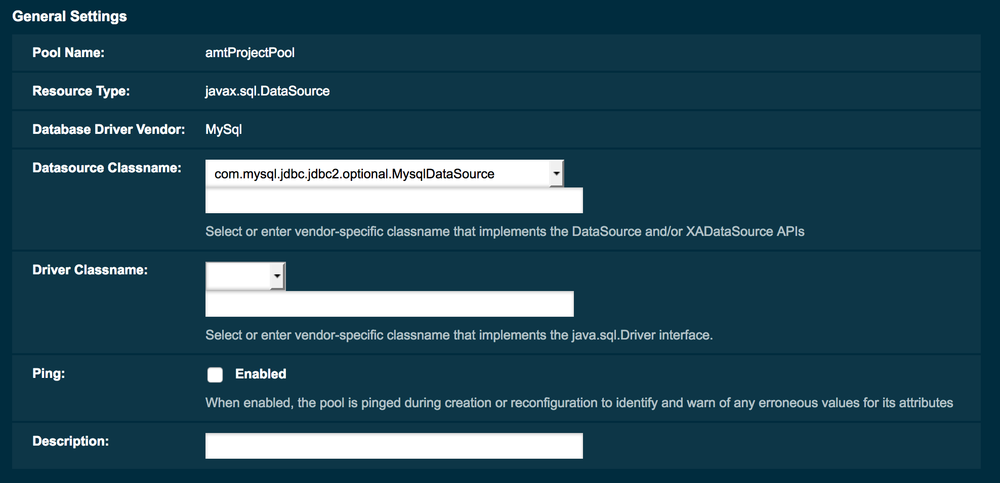
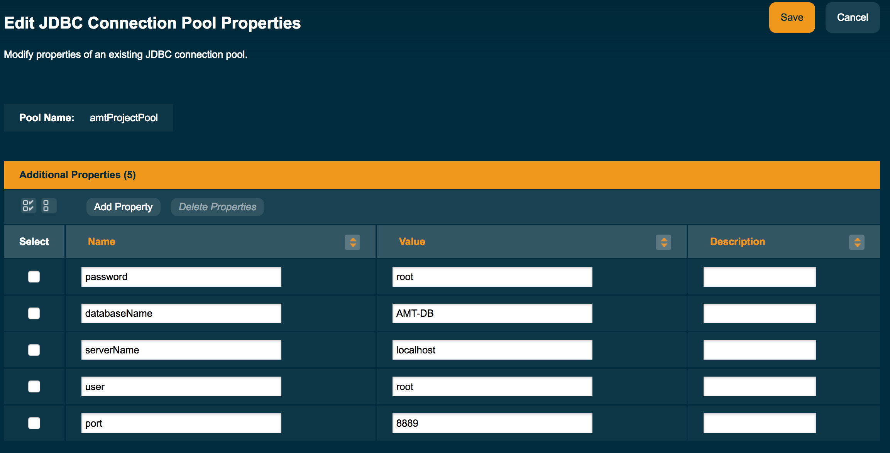
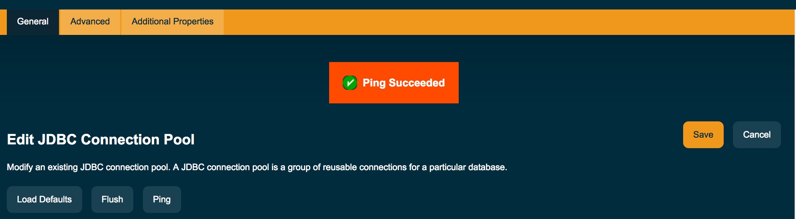
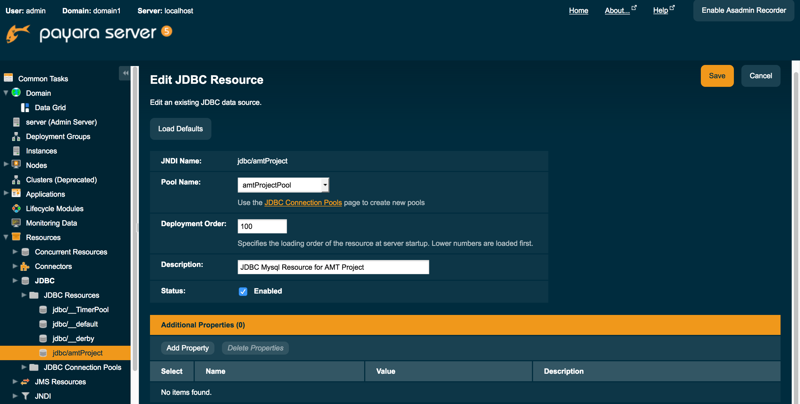

# Configuration de la connexion à la DB

Se connectioner à la plateforme d'administration de Payara

http://localhost:4848/common/index.jsf


#### Prérequis

il faut avoir lancé MAMP/WAMP/LAMP avec une base de données qui tourne.


#### Information

Le connecteur JDBC MySQL se trouve  dans ```./Database/mysql-connector-java-5.1.34.jar```

Le script de la DB INCOMPLET :shit: se trouve dans ```./Database/create_db```


Aller dans Ressources 

* Ressources
* JDBC
* JDBC Connection Pools




Ensuite "New"

Il faut créer un pool de connection pour MySQL.




Remplir les informations de connexion comme ci-dessous.



Cliquer sur "Next"



Remplir les informations de la DB



Sauvegarder.


Tester la connexion à la DB avec le ping




Aller ensuite dans 

* Resources
* JDBC
* JDBC Resources

Ajouter un nouveau basé sur le pool précédent.




Dans IntelliJ, on va maintenant plus se connecter directement à la DB mais ce sera géré par Payara.

```java
package Database;


import javax.annotation.Resource;
import javax.ejb.Stateless;
import javax.sql.DataSource;
import java.sql.PreparedStatement;
import java.sql.ResultSet;
import java.sql.SQLException;

@Stateless
public class UserDAO {

    private final static String TABLE_NAME = "users";

    @Resource(lookup = "jdbc/amtProject")
    private DataSource database;

    public Boolean findIfEnableUserExist(String  email, String password) {
        try {
            PreparedStatement prepare = database.getConnection()
                    .prepareStatement("SELECT * FROM " + TABLE_NAME +" WHERE email = ? AND password = ? AND enable=1;");
            prepare.setString(1, email);
            prepare.setString(2, password);
            ResultSet result = prepare.executeQuery();
            if (result.next()) {
                System.out.println("[UserDAO - findIfUserExist]" + (result.getString("email")));
                System.out.println("[UserDAO - findIfUserExist]" + (result.getString("firstname")));
                System.out.println("[UserDAO - findIfUserExist]" + (result.getString("lastname")));

                return true;
            }
        } catch (SQLException e) {
            e.printStackTrace();
        }
        return false;
    }
```


On appelera les fonctions comme cela

```java
public class ServletLogin extends javax.servlet.http.HttpServlet {

    @EJB
    private UserDAO userDao;
    
    
    public void fonctionBidon () {
        boolean userExist = userDao.findIfEnableUserExist(email, password);
    }
```

